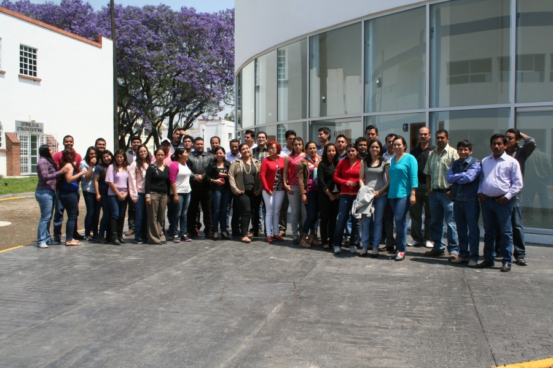

R counrse in Mexico, April 2015
===============================

This web page is for the R course at *Universidad Autónoma Chapingo*, Mexico, April 2015.  
Course notes, presentation files, R scripts and sample data will be provided here during the course.  

**Registeration form:** <a href="http://goo.gl/forms/K8oiq1nU0i" target="_blank">http://goo.gl/forms/K8oiq1nU0i</a>  

**Course schedule:**  

Date | Time | Time
--- | --- | ---
Monday, 13 April | 10:30-12:00 | 14:00-16:00
Tuesday, 14 April	|| 14:00-16:00
Wednesday, 15 April	|| 14:00-16:00
Thursday, 16 April | 09:00-11:00 | 14:00-16:00
Friday, 17 April | 10:30-12:30 |
Monday, 20 April || 14:00-16:00

**Other schedules:**  

Date | Time
--- | ---
Wednesday, 15 April | 13:00-14:00 (Interbull Activities)
Tuesday, 21 April | 15:30-17:30 (Pedigree checking and package pedigreemm)
Wednesday, 22 April | 13:00-14:00 (An Introduction to International genetic evaluations of Bovine)
Thursday, 23 April | 10:00-12:00 (Genomic evaluation)

**Home work 1:** <a href="http://goo.gl/forms/b5qp5Wlwxl" target="_blank">http://goo.gl/forms/b5qp5Wlwxl</a>  
**Home work 2:** <a href="http://goo.gl/forms/4wFaFXOQ7E" target="_blank">http://goo.gl/forms/4wFaFXOQ7E</a>  

**Dear student**, please follow this <a href="https://nilforooshan.github.io/rreview.html" target="_blank">link</a> to get the **R codes** that I share with you during the course.

**Dear student**, you can **download** the presentation and data files below.  
Course materials for each day will be provided the same day.  

File | Description | Size
--- | --- | ---
<a href="https://drive.google.com/file/d/0B2l_izQwJmVpTDdhRDE1d2dBaWc/view?usp=sharing" target="_blank">20150415.pdf</a> | Presentation file "Interbull Activities"; Wednesday, 15 April 2015 | 567k
<a href="https://drive.google.com/file/d/0B2l_izQwJmVpR2NEZDlteXpxbVk/view?usp=sharing" target="_blank">20150422.pdf</a> | Presentation file "An Introduction to International genetic evaluations of Bovine"; Wednesday, 22 April 2015 | 2236k
[beetle.csv](https://drive.google.com/uc?export=download&id=0B2l_izQwJmVpdTAtQ1Q1Sy1DbjA) | Experiment data for a sire model analysis of beetle fecundity (Data: Messina & Fry, 2003) | 5k
[data1.csv](https://drive.google.com/uc?export=download&id=0B2l_izQwJmVpb0oxelltMmk2Z1k) | data1.txt, comma separated | 10k
[data1.txt](https://drive.google.com/uc?export=download&id=0B2l_izQwJmVpQ2tnbVp5cU90SDA) | Sample data, containing ID, protein level in the diet, birth weight, and wean weight of animals | 10k
[homework1.txt](https://drive.google.com/uc?export=download&id=0B2l_izQwJmVpYVJhZ2Vic1V1STA) | <http://goo.gl/forms/b5qp5Wlwxl> | 1k
<a href="https://drive.google.com/file/d/0B2l_izQwJmVpRE9mVHlqM2pwTTQ/view?usp=sharing" target="_blank">pedigreemm.pdf</a> | Presentation file about pedigree checking and pedigreemm | 705k
<a href="https://drive.google.com/file/d/0B2l_izQwJmVpZEdYY2s5c1BYdE0/view?usp=sharing" target="_blank">Presentation_day1.pdf</a> | Presentation file from the 1st day | 4377k
<a href="https://drive.google.com/file/d/0B2l_izQwJmVpVG1MSnpsMWR1a3M/view?usp=sharing" target="_blank">Presentation_day2.pdf</a> | Presentation file from the 2nd day | 1526k
<a href="https://drive.google.com/file/d/0B2l_izQwJmVpRlg0TkhEOV9nZ28/view?usp=sharing" target="_blank">Presentation_day3.pdf</a> | Presentation file from the 3rd day | 1916k
<a href="https://drive.google.com/file/d/0B2l_izQwJmVpM0FfWi1CcDV2d0U/view?usp=sharing" target="_blank">Presentation_day4.pdf</a> | Presentation file from the 4th day | 2664k
<a href="https://drive.google.com/file/d/0B2l_izQwJmVpQXlDR1dZVFZPYk0/view?usp=sharing" target="_blank">Presentation_day5.pdf</a> | Presentation file from the 5th day | 1446k
<a href="https://drive.google.com/file/d/0B2l_izQwJmVpdnFhQm1yc3ZrbkE/view?usp=sharing" target="_blank">Presentation_day6.pdf</a> | Presentation file from the 6th day | 1483k

